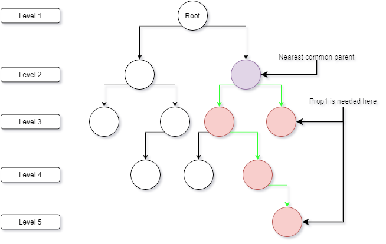
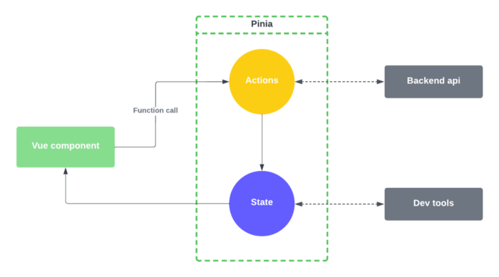
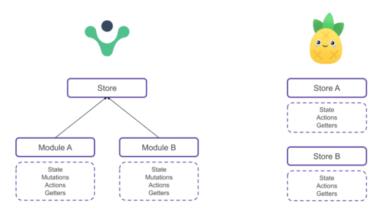

# State Management (in Vue)

## What is state management?

How we manage the state of the frontend. For example:

-   (local) component state: props of a component, e.g. color, size, icon
-   (global) layout state: Is a modal open? What content does it have? Should we render this button? Display a notification message. Etc.
-   (global) API data state: user credentials, results of API calls (data retrieved/mutations)

We can use (additional) state management tools to make it easier to share global state across components.

### How data flows without state management

### How data flows with (uni-directional) state management

## Why use a state management tool

### Advantages

-   Single source of truth for the data
-   Data flows in one direction. (Easier reasoning about state)
-   Avoid a lot of unnecessary API calls. Take load of the backend server.
-   Allow for responsive frontends by mutating state before making POST/PUT/DELETE calls
-   Easy to automatically sync with local storage (if desired)
-   Stricter team conventions, no more confusion about what state should look like and where it is defined. Less room for mistakes.

### Disadvantages

-   Another tool to learn
-   Extra dependencies. Luckily Pinia is only ~1KB and only has 2 dependencies, which allow for integration with the Vue devtools. :)

## Demo!

I'm going to demo three examples of how we can share state across components using:

-   Prop drilling
-   Reactivity API
-   Pinia

### Why Pinia over Reactivity:

https://pinia.vuejs.org/introduction.html#why-should-i-use-pinia

https://www.reddit.com/r/vuejs/comments/s8ifhf/global_reactive_objects_in_vue_3_why_would_i_need/
